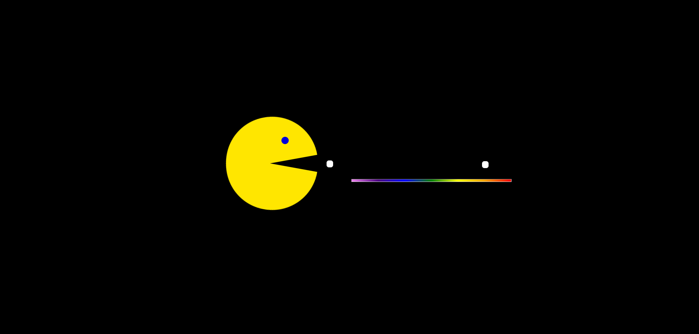

# 🟡 Retro Pac-Man Animation

A simple and fun **CSS-only animated Pac-Man** inspired by the classic arcade game.  
Features smooth mouth movement, blinking eye, and animated dots traveling on a vibrant rainbow path — all created with pure HTML and CSS.

---

## 🎨 Features

- 🦷 Animated Pac-Man mouth opening and closing using CSS keyframes
- 👁️ Blinking eye with smooth color transition
- 🍒 Moving food dots simulating Pac-Man's path
- 🌈 Colorful rainbow track beneath Pac-Man
- 🚫 No JavaScript — fully CSS animated
- 🕹️ Classic retro arcade style with black background and bright yellow Pac-Man

---

## 🛠️ Built With

| Technology | Purpose             |
| ---------- | ------------------- |
| 🧱 HTML5   | Structure           |
| 🎨 CSS3    | Animation & Styling |

---

## 📸 Screenshot

## 🌐 Live Demo

🔗 **View it on GitHub Pages:**

---

## 📧 Connect with Me 🟡

🔗 **LinkedIn:**  
https://www.linkedin.com/in/gaurav-lad1974

📨 **Email:**  
gauravlad1974@gmail.com
